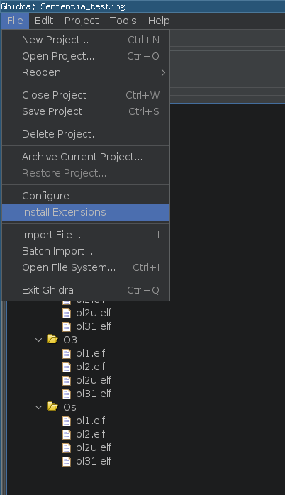
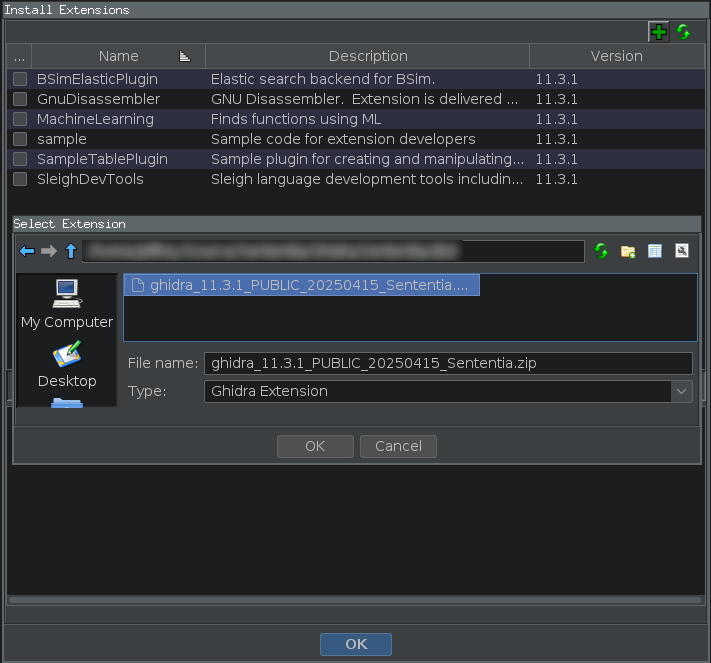
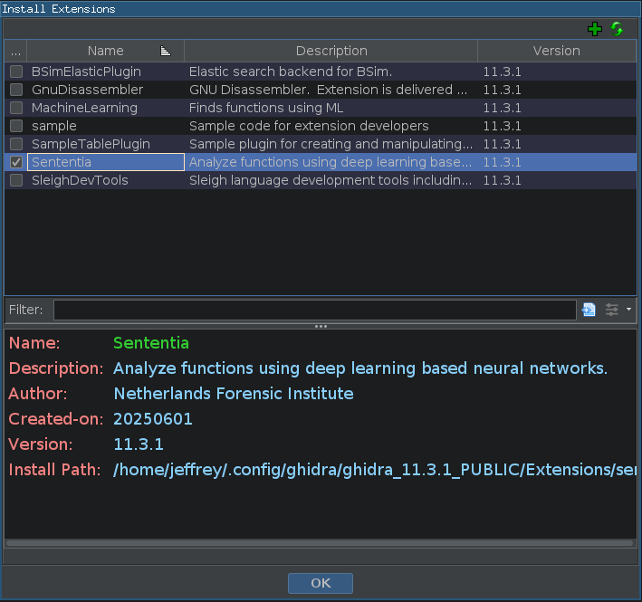
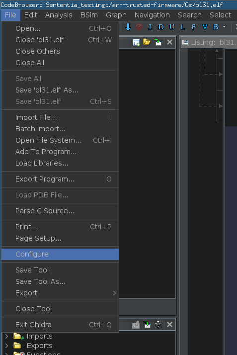
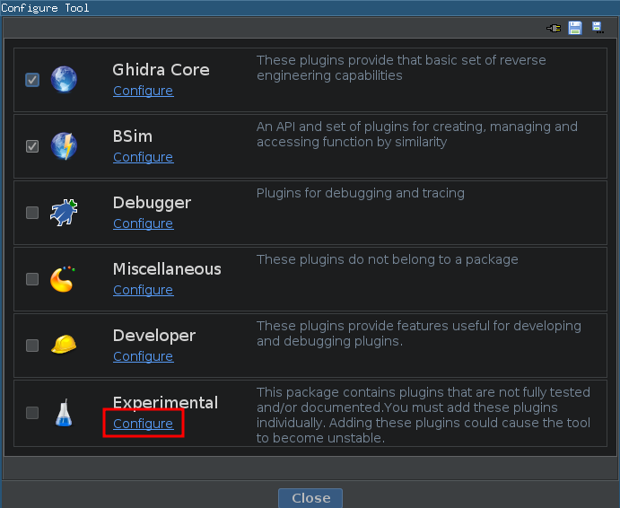
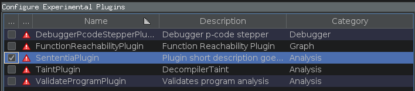
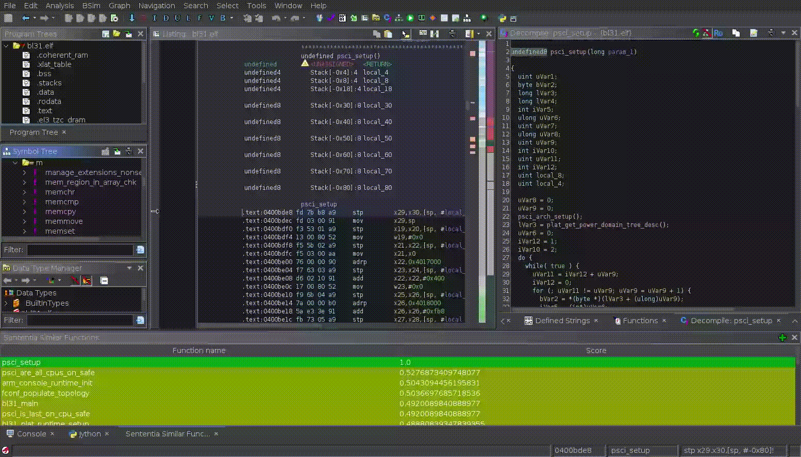
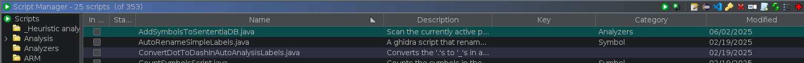
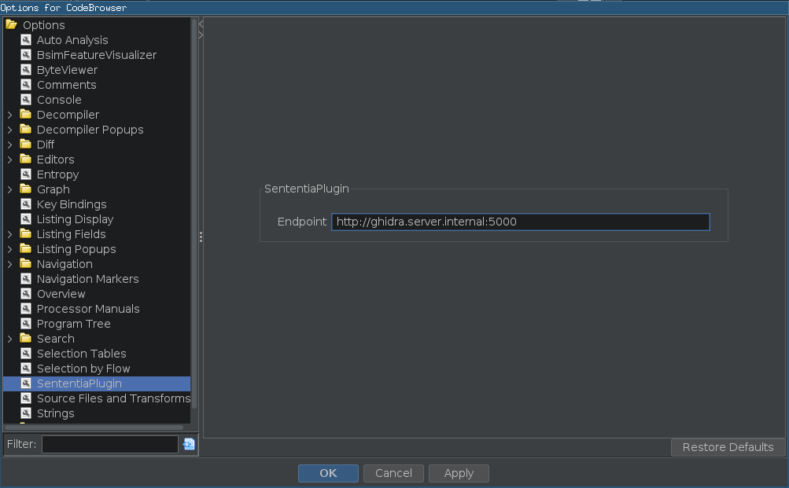

# Sententia 🧬

Sententia is a Ghidra plugin that mainly serves as a frontend for the **ASM Transformers** server and model. It has two main features:

- Analyzing functions to provide suggestions for function names based on the ASM Transformer database.
- Adding new function signatures from analyzed binaries to the ASM Transformers database.

## Installing 
To use the plugin, simply install the Ghidra extension for your Ghidra version from the releases:





Then restart your Ghidra instance and open a binary to analyze.

Now you should be able to configure the plugin from the Ghidra interface:





This will enable the Sententia plugin.

## Usage

### Finding similar functions

Enabling the plugin will open an extra window to show the Sententia interface:



As can be seen above, clicking inside a function in the **Decompiler** or **Listing** window now updates the Sententia plugin window with the results of the most similar functions in the database. Double clicking the function name in the Sententia window will rename the current function with that function name.

If you close this window, it's also available from the **Window** dropdown in the menu bar.

### Adding functions to the database

As long as a correct server url is entered in the tool options, Sententia has 2 ways to add your functions to the database:

- Renaming a function will add it to the database.
- The plugin will add a script called `AddSymbolsToSententiaDB.java`, which will add all functions in the active file to the database:


## Configuring

### Sententia endpoint

Sententia is a frontend for the **ASM Transformers** server, called **Citatio**. To use it, you will need to setup the server first and then set the correct endpoint in the Sententia options. To do this, go to **Edit > Tool > SententiaPlugin** and enter the correct endpoint:




## Building

Building the extension can be done in the usual manner, simply go to the `sententia` directory (that contains this README) and run:

```bash
$ gradle -PGHIDRA_INSTALL_DIR=/opt/ghidra 
```

Replacing `/opt/ghidra` with your Ghidra installation directory. If the build succeeds, the result will then be available for installing inside the `dist` directory.
